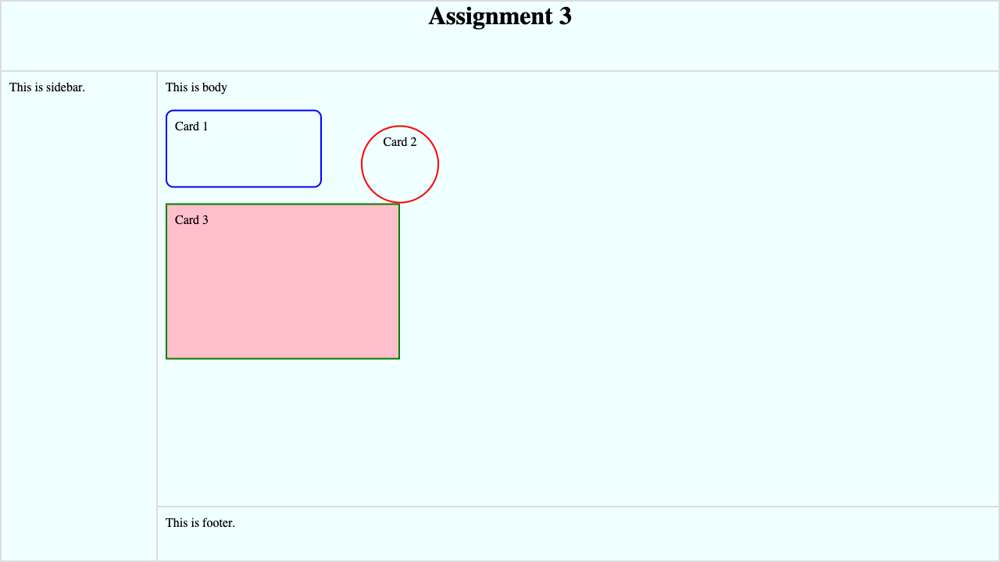

## Assignment 3: Tipping Ball

Your task is to style a given web page to exactly match the below screenshot.

https://fullstack-dev-assets.s3.ap-south-1.amazonaws.com/523/03/03.png

## Setup
* In a directory `03/assign/`, place the `index.html` file already shared for this assignment.
* Create a file named `style.css` in the directory `03/assign/`.
* Do not modify anything in `index.html` file. All styles must be present in the `style.css` file only.

## Specifications
* Page:
  - page background color is `azure`
  - page layout using table is already provided in the html file
  - elements can be styled using class names already provided in the html file.
  - you cannot add any new class names because you must not modify the given html file
  - table borders for layout are `2px` wide and have color `gainsboro`
  - table width and height should be equal to viewport width and height.
  - for table height you can use the `vh` unit
  - page title (inside `head`) should be `Assignment 3`
* Header
  - heading is an `h1` element with text `Assignment 3`
  - has a height of `90px`
* Sidebar
  - has a width of `200px`
  - padding on all sides is `10px`
* Body
  - padding on all sides is `10px`
* Card 1:
  - border of color `blue` and `2px` thick
  - has a width of `200px`
  - has a height of `100px`
  - has a border radius of `10px`
  - has a padding of `10px` on all sides
  - has a top and bottom margin of `20px`
* Card 2:
  - border of color `red` and `2px` thick
  - circle has a width of `100px`
  - circle has a height of `100px`
  - has a padding of `10px` on all sides
  - the lowest point of circle _just_ touches the top-right corner of Card 3
* Card 3:
  - border of color `green` and `2px` thick
  - has a width of `300px`
  - has a height of `200px`
  - backgound color is `pink`
  - has a padding of `10px` on all sides
* Footer
  - has a height of `70px`
  - padding on all sides is `10px`

## Submission
* The **deadline** for the submission of this assignment is **Jun 2, 2023 (Fri) 11:59pm**.
* Your entire submission should just be a *single* `style.css` file correctly working in the above mentioned setup.
* You can submit the assignment by sending an email to:
  - [abhi@raj.me](mailto:abhi@raj.me)
  - Subject: **Submit: Assignment 3**
  - Attachment: `style.css` file only
