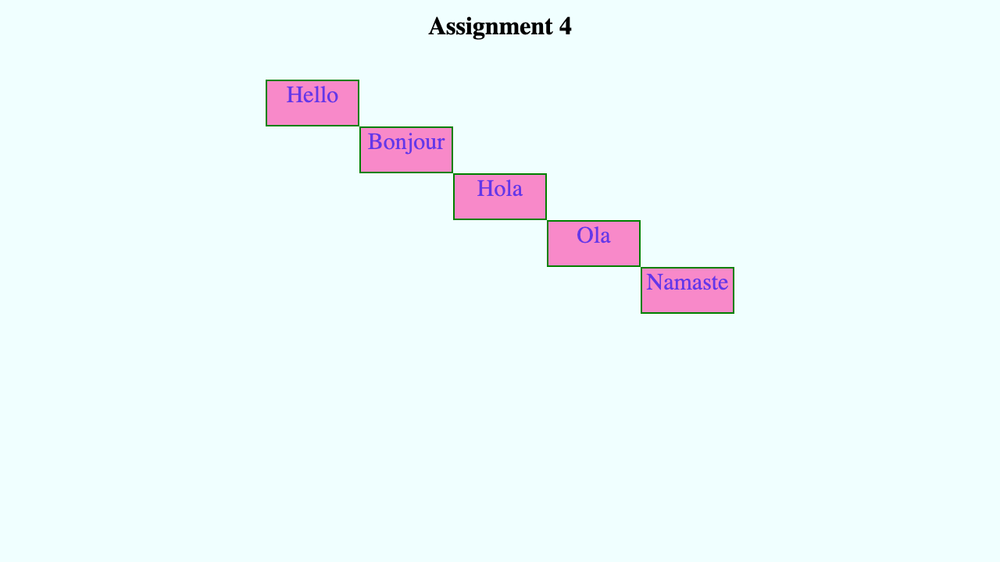

## Assignment 4: Hello Stairs

Your task is to style a given web page to exactly match the below screenshot.

https://fullstack-dev-assets.s3.ap-south-1.amazonaws.com/523/04/04.png

## Setup
* You can download the contents of `index.html` file from [here](https://fullstack-dev-assets.s3.ap-south-1.amazonaws.com/523/04/index.html) `view-source:https://fullstack-dev-assets.s3.ap-south-1.amazonaws.com/523/04/index.html`
* In a directory `04/assign/`, place the `index.html` file already shared (above) for this assignment.
* Create a file named `style.css` in the directory `04/assign/`.
* Do not modify anything in `index.html` file. All styles must be present in the `style.css` file only.

## Specifications
* Page:
  - page background color is `azure`
  - page layout is already provided in the html file
  - elements can be styled using class names or tag names already provided in the html file
  - you cannot add any new class names because you must not modify the given html file
  - page title (inside `head`) should be `Assignment 4`
* Header
  - heading is an `h1` element with text `Assignment 4`
  - has a top margin of `15px`
* Body
  - has a staircase like structure as shown in the image
  - each block in the staircase has exact same dimensions, i.e. a height of `60px` and `120px` wide
  - the top-most block (i.e., the top-left one) of the staircase starts `50px` below the page heading
  - the text is various blocks are: Hello, Bonjour, Hola, Ola, Namaste
  - font size of text in all the blocks is `30px`
  - the text in the block in horizontally center-aligned
  - each of the blocks has a border of `2px` thick and is of color `green`
  - starting with second block, each of the blocks starts with its top-left corner _just_ touching the bottom-right corner of the previous block
  - the whole staircase structure is horizontally center-aligned w.r.t. the viewport
  - the background color of each block is `deeppink` with an _opacity_ of `80` in hexadecimal (or `128` in 0-255 decimal range)
  - the color of text inside each block is `blue` with an _opacity_ of `99` in hexadecimal (or `153` in 0-255 decimal range)

## Submission
* The **deadline** for the submission of this assignment is **Jun 6, 2023 (Tue) 11:59pm**.
* Your entire submission should just be a *single* `style.css` file correctly working in the above mentioned setup.
* You can submit the assignment by sending an email to:
  - [abhi@raj.me](mailto:abhi@raj.me)
  - Subject: **Submit: Assignment 4**
  - Attachment: `style.css` file only
