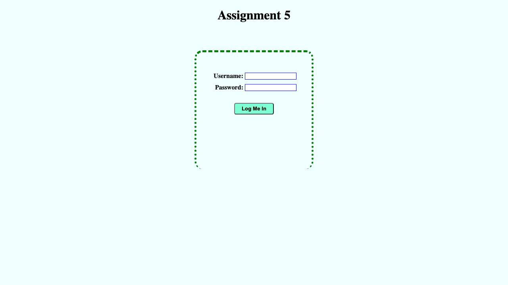

## Assignment 5: Log Me In

Your task is to style a given web page to exactly match the below screenshot.

https://fullstack-dev-assets.s3.ap-south-1.amazonaws.com/523/05/05.png

## Setup
* You can download the contents of `index.html` file from [here](https://fullstack-dev-assets.s3.ap-south-1.amazonaws.com/523/05/index.html) `view-source:https://fullstack-dev-assets.s3.ap-south-1.amazonaws.com/523/05/index.html`
* In a directory `05/assign/`, place the `index.html` file already shared (above) for this assignment.
* Create a file named `style.css` in the directory `05/assign/`.
* Do not modify anything in `index.html` file. All styles must be present in the `style.css` file only.

## Specifications
* Page:
  - page background color is `azure`
  - page layout is already provided in the html file
  - elements can be styled using class names or tag names already provided in the html file
  - you cannot add any new class names because you must not modify the given html file
  - page title (inside `head`) should be `Assignment 5`
* Header
  - heading is an `h1` element with text `Assignment 5`
  - has a top margin of `20px`
* Body
  - has a login form having width and height as `300px`
  - the login form has `green` border `5px` thick with border radius `20px`
  - the gap between page heading and top side of the border is `70px`
  - login form has top padding of `50px`
  - login form has left and right padding of `15px`
  - `span` elements inside label is `80px` wide each
  - `input` elements inside label is `130px` wide each with `blue` border `1px` wide
  - both the input elements should be aligned without any horizontal shift difference
  - the vertical gap between the two input elements is `10px`
  - the texts visible inside the form are bold/strong.
  - both the label blocks (containing text and input elements) are center-aligned horizontally
  - the button is `100px` wide and has text **Log Me In**
  - button has background color `aquamarine` and bordder radius `5px`
  - the margin above the button is `30px`
  - the button is center-aligned horizontally
  - button element has a padding of `5px`

## Submission
* The **deadline** for the submission of this assignment is **Jun 9, 2023 (Fri) 11:59pm**.
* Your entire submission should just be a *single* `style.css` file correctly working in the above mentioned setup.
* You can submit the assignment by sending an email to:
  - [abhi@raj.me](mailto:abhi@raj.me)
  - Subject: **Submit: Assignment 5**
  - Attachment: `style.css` file only
